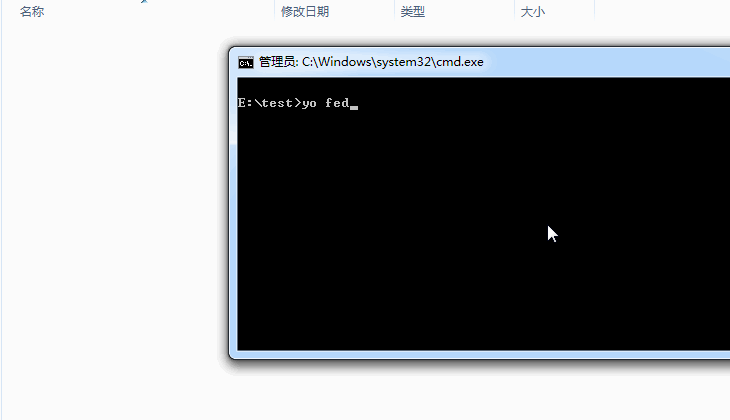

# generator-fedp [](https://travis-ci.org/hiwanz/generator-fedp)

It's a generator for [Yeoman](http://yeoman.io) that aimed to automatically create a front-end development framework,containing a set of grunt plugins to help you testing,compiling,linting,concating,uglifying your javascript codes.

You can also read a Chinese version of document here:[帮助文档](https://github.com/hiwanz/generator-fedp/wiki/%E5%B8%AE%E5%8A%A9%E6%96%87%E6%A1%A3 "帮助文档")

## Getting Started

### Pre-requirements

You need to have [Nodejs](http://nodejs.org/) and Yeoman workflow kit([Yo](http://yeoman.io/),[Bower](http://bower.io/) and [Grunt](http://gruntjs.com/)) installed firstly.

### Quick start with fedp generator

Yeoman travels light. He didn't pack any generators when he moved in. You can think of a generator like a plug-in of Yeoman,and generator-fedp is one of them.

To install generator-fedp from npm, run:

```
$ npm install -g generator-fedp
```

Finally, initiate your project with the generator in your project folder:

```
$ yo fedp
```

To initiate your project without the automatic execution of ```bower``` and ```npm``` after scaffolding has finished, run:

```
$ yo fedp --skip-install
```

Run `grunt` command and start writing codes in `src` folder,then have fun.



### Configuration

**Gruntfile.js** and **bower.json** are the config files.You don't need to configure anything before you start using fedp,cuz they had been configured to meet your basic requirement of development when you initiated the project.

If you'd like to get things done better, check out the [Grunt](http://gruntjs.com) and [Bower](http://bower.io) for more information,all configurations you need to know are based on them.


## License

[MIT License](http://en.wikipedia.org/wiki/MIT_License)
